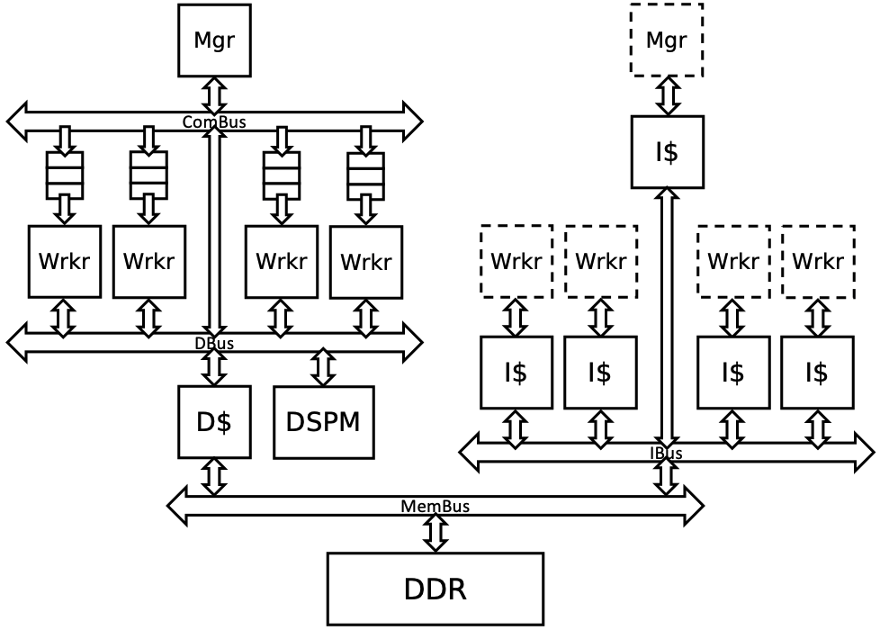

# HetSim-gem5

HetSim is a gem5-based trace-driven, synchronization and dependency-aware framework for fast and accurate pre-silicon performance and power estimations for heterogeneous systems with up to thousands of cores.

## Prerequisites
### Build gem5 and Install Cross-Compiler
We have provided a script to build gem5 inside `scripts/`.
```bash
cd scripts
bash build_gem5.sh
```
You would also need to download cross compilers for the target system's ISA. The example target in this repository uses programmable PEs that run the Arm Thumb ISA. Download the latest `arm-linux-gnueabihf` toolchain from [Linaro](https://www.linaro.org/downloads/). Alternatively, run `sudo apt install g++-arm-linux-gnueabihf` in your shell.

### Install LLVM
LLVM is a pre-requisite for automatic tracing. The minimum required version is LLVM 10. If it is not available through your package manager, LLVM can be installed from source, by following the instructions [here](https://llvm.org/docs/GettingStarted.html).

## Write Application for Target
The example model is packaged with a sample application called `workq_mutex` that uses pthreads to spawn threads that run on the PEs and atomically increment a counter. It also involves the manager sending data and pointers to the PEs through private work queues. The source code for this application is in `example/app/src/workq_mutex.cpp`.

### Simulation Library for Programmable PEs
HetSim works with both programmable and fixed-function accelerators. For applications written for programmable targets, such as the example target, we include the inline primitives defined in `example/sim/inc/util.h`.

## Create Target Model
Create a gem5 model of the target architecture using cycle-accurate core models. This is the baseline (detailed) version of the target.

The gem5 config file for an example model is provided in `example/model/target.py`. A block diagram of this target is shown below.



This is a programmable accelerator where the manager and worker PEs execute Arm Thumb instructions.

### User Specification File
Various parameters for the primitives specific to your model are defined in `spec/spec.json`. This includes the connectivity of queues in the example target system.

The llvm_instr field specifies which LLVM IR instructions are to be traced as stalls. The naming requires the use of LLVM instructions as defined in: https://llvm.org/svn/llvm-project/llvm/trunk/include/llvm/IR/Instruction.def

### Changing Target Parameters
Various target-specific parameters, such as number of PEs, depths of queues, number of outstanding requests, etc. can be configured in `example/model/params.h`.

> If you change parameters that affect the number of cores, the same needs to be reflected in (i) the `source` and `sink` parameters that define the queue connections, and (ii) the `id` fields for each PE type.

After you adjust this file, run `populate_init_queues.py` from `scripts/` that will generate C++ code to create software queues based on the connections specified in `spec.json`. Following this, you would need to rebuild gem5, using `scripts/build_gem5.sh`.

## Run gem5 Simulation
We first build the m5op library to use with gem5 (one-time).
```bash
cd gem5/util/m5
scons
```
> If you hit an error due to missing cross-compilers for ISAs that you do not need, either download the missing cross-compilers or as a temporary workaround remove the corresponding files in `gem5/util/m5/src`, _e.g._ to remove the m5op library for SPARC, delete `gem5/util/m5/src/sparc`.

Next, let us compile and run the `workq_mutex` example application on gem5.
```bash
# build application
cd example/app
mkdir build && cd build
rm -f CMakeCache.txt # run this if previously ran cmake with different MODE
MODE=SIM cmake .. && make
# run gem5 simulation
cd ../../../scripts
MODE=SIM APP=workq_mutex ./run-gem5.sh
```

## Build Emulation Library
The emulation library contains HetSim primitive implementations and are compiled as a static library and later linked into the user application.
```bash
cd emu
mkdir build && cd build
cmake ..
make
```

## Run on Emulation
Now let's compile and run the `workq_mutex` example application natively, i.e. on _emulation_. This requires us to have already built the emulation library. You can double-check this by verifying that the file `emu/build/libhetsim_prim.a` exists.
```bash
cd example/app
mkdir build && cd build
rm -f CMakeCache.txt # run this if previously ran cmake with different MODE
MODE=EMU cmake .. && make
./workq_mutex
```
At this stage, verify that the results are functionally correct.

## Run on Emulation with Automatic Tracing
```bash
# generate plugin
cd scripts && python generate_model.py ../spec/spec.json
# build tracing library
cd tracer
mkdir build && cd build
cmake ..
make
# build user app
cd ../example/app
mkdir build && cd build
mkdir traces
rm -f CMakeCache.txt # run this if previously ran cmake with different MODE
MODE=EMU_AUTO_TRACE cmake ..
make
# trace generation
./workq_mutex # traces are generated in example/app/build/traces
# trace replay
MODE=EMU_TRACE APP=workq_mutex ./run-gem5.sh
```
### Annotating using Manual Tracing
HetSim also allows you to manually annotate your application program with the tracing calls.
* _Manual tracing on top of automatic tracing._ Add invocations to the tracing calls generated in `tracer/runtime/default/hetsim_default_rt.h` into the application code. Remaining steps remain unchanged.
* _Manual tracing instead of automatic tracing._ Change `MODE` from `EMU_AUTO_TRACE` to `EMU_MANUAL_TRACE` in the previous step. Steps for trace generation and replay remain unchanged.
```bash
# build user app
cd ../example/app
mkdir build && cd build
mkdir traces
rm -f CMakeCache.txt # run this if previously ran cmake with different MODE
MODE=EMU_MANUAL_TRACE cmake ..
make
```

## Citing
If you found HetSim to be useful in your work, please drop a citation to our IISWC 2020 paper.
```
@inproceedings{pal2020hetsim,
  author    = {Subhankar Pal and
               Kuba Kaszyk and
               Siying Feng and
               Björn Franke and
               Murray Cole and
               Michael O'Boyle and
               Trevor Mudge and
               Ronald Dreslinski},
  title     = {HetSim: Simulating Large-Scale Heterogeneous Systems using a Trace-driven, Synchronization and Dependency-Aware Framework},
  booktitle = {{IEEE} International Symposium on Workload Characterization (IISWC) 2020, Virtual, October 27-29, 2020},
  pages     = {},
  publisher = {IEEE},
  year      = {2020, to appear}
}
```

## Contributing and Discussion
We greatly welcome and appreciate user contributions to our repository! Please create a pull request from a forked version of this repository. To raise any issue, please use the issue tracker in GitHub.
